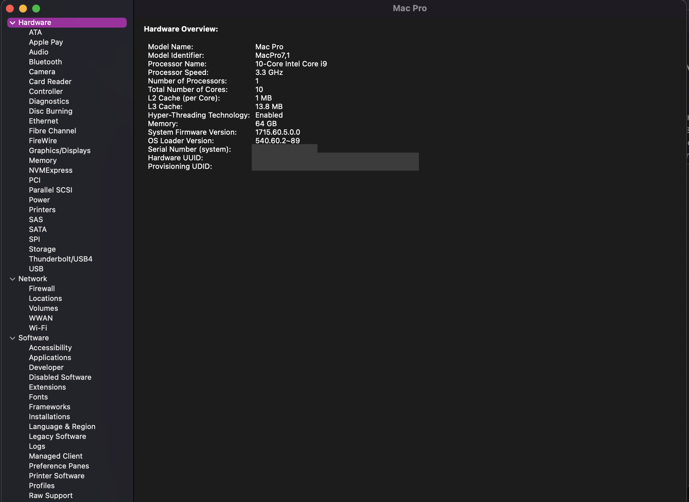

# ASUS X299 Hackintosh

# Introduction
The ASUS X299 Hackintosh repository contains OpenCore EFI distributions and related files that can be used as a reference when setting up or updating your X299 Hackintosh with the OpenCore bootloader.  While the EFIs can be used as a starting point for all ASUS X299 boards, it is still highly recommended to review the [OpenCore Vanilla Desktop Guide](https://dortania.github.io/OpenCore-Install-Guide/) and [Skylake-X section](https://dortania.github.io/OpenCore-Install-Guide/config-HEDT/skylake-x.html) for a full guide.  These files were created using the ASUS ROG Rampage VI Extreme Encore as a baseline.

# Repository Folders
| Folder | Description |
| :------------- | :---------- |
| BASE-EFI | OpenCore EFI distributions that should be valid for all ASUS X299 boards |
| Intel 10G SmallTree | Information about configuring Intel 10G ports for macOS support |
| Thunderbolt | Information about configuring Thunderbolt 3/4 for macOS |
| USB Kexts | Mapped motherboard USB kexts |

# Personal Build

## Specifications
### Components

| Component        | Model                                | Notes |
| ---------------- | ---------------------------------------|-------------------|
| Motherboard | ASUS ROG Rampage VI Extreme Encore | BIOS 1301 |
| Processor | Intel i9-7900X | |
| CPU Cooler | Fractal Design Celsius+ S36 Dynamic | |
| RAM | 4x16 Corsair Dominator Platinum RGB 3200 Mhz | |
| Boot Drive | Sabrent Rocket 1 TB | |
| Graphics Card | AMD Radeon Pro W5500 | |
| Wifi/Bluetooth Card | Broadcom BCM943602CDP |  |
| Power Supply | Corsair RM 850x | |
| Case | Lian Li PC 011 Dynamic | |

### PCIe Slot Layout
| Slot | PCIe Gen | Speed | Device | Notes |
| ----- | ----- | ----- |---------------------------------------|-------------------|
| 1 | 3 | x16 | AMD Radeon Pro W5500 | |
| 2 | 3 | x4 | | PCH (Enabling disables M.2_1) |
| 3 | 3 | x16 | | (Running at x16 disables DIMM.2_2) |
| 4 | 3 | x4 | Broadcom BCM943602CDP | |

### M.2/DIMM.2 Layout
| Slot | PCIe Gen | Device | Notes |
| ----- | ----- |---------------------------------------|-------------------|
| M.2_1 | 3 | | Disabled |
| M.2_2 | 3 | | |
| DIMM.2_1 | 3 | Sabrent Rocket 1 TB | |
| DIMM.2_2 | 3 | | Disabled |

## What Works / What Doesn't Work
- [x] Sleep / Wake
- [x] Wifi and Bluetooth
  * Disabled onboard Wifi/Bluetooth since using Broadcom BCM943602CDP card.
- [x] Handoff, Continuity, AirDrop, Continuity Camera, Universal Control, and Unlock with Apple Watch
- [x] iMessage, FaceTime, App Store, iTunes Store
- [x] 1G Ethernet
- [x] 10G Ethernet
- [x] HEVC, H.264
- [x] Onboard audio
- [x] TRIM
- [x] USB 2.0
- [x] USB 3.2 Gen 1
- [x] USB 3.2 Gen 2
- [x] USB 3.2 Gen 2x2
- [x] DRM
- [x] Native NVRAM
- [x] CPU Power Management
- [x] USB Power
- [ ] SideCar
    * Due to some T2 chip dependancies on MacPro7,1 and iMacPro1,1 SMBIOS

## Screenshots

### System Report

### Memory

### Audio

### Ethernet

### GPU

### NVME

### SATA

### USB

### PCI

# Optional USB Peripherals for Internal USB 2.0 Devices
* 1. [USB 3.0 20 Pin Female to USB 2.0 Pin Male Adapter](https://www.amazon.com/gp/product/B01MFB04JP/ref=ppx_yo_dt_b_search_asin_title?ie=UTF8&psc=1)
    * This adapter converts the internal USB 3.0 19 pin header to a USB 2.0 9 pin.
* 2. [USB 2.0 9 Pin Header 1 to 4 Extension Hub Splitter](https://www.amazon.com/gp/product/B085KVH16T/ref=ppx_yo_dt_b_search_asin_title?ie=UTF8&psc=1)
* 3. [USB 2.0 IDC 5 Male to USB A Male adapter](https://www.amazon.com/gp/product/B000V6WD8A/ref=ppx_yo_dt_b_search_asin_title?ie=UTF8&psc=1)
    * Uses one of the USB ports on the back of the motherboard to connect internal devices in the case.  You can use two of these together and remove 1 of the pins to make a "9 pin internal adapter".  If the cable is too short to reach inside the case, you can extend with a USB A extension cable.
* 4. PCIe USB 3.0 Card with Internal USB Connector
    * [Inateck USB 3.0 Card](https://www.amazon.com/Inateck-Express-Controller-Internal-Connector/dp/B00JFR2H64/ref=sr_1_3?dchild=1&keywords=inateck+pcie+card&qid=1592455853&s=electronics&sr=1-3)
    * [StarTech USB 3.1 PCIe Card](https://www.amazon.com/gp/product/B01I39D15A/ref=ppx_yo_dt_b_search_asin_title?ie=UTF8&psc=1)
    * Can use the internal header on the card for the case USB ports or to connect internal devices.
    * **NOTE**: Wake from Bluetooth devices does not work with this so it's best to connect Bluetooth to one of the motherboard ports.

# Credits
* [Apple](https://www.apple.com) : macOS
* [Acidanthera](https://github.com/acidanthera) : OpencorePkg, kexts, etc.
* [Dortania](https://github.com/dortania) : Opencore guide
